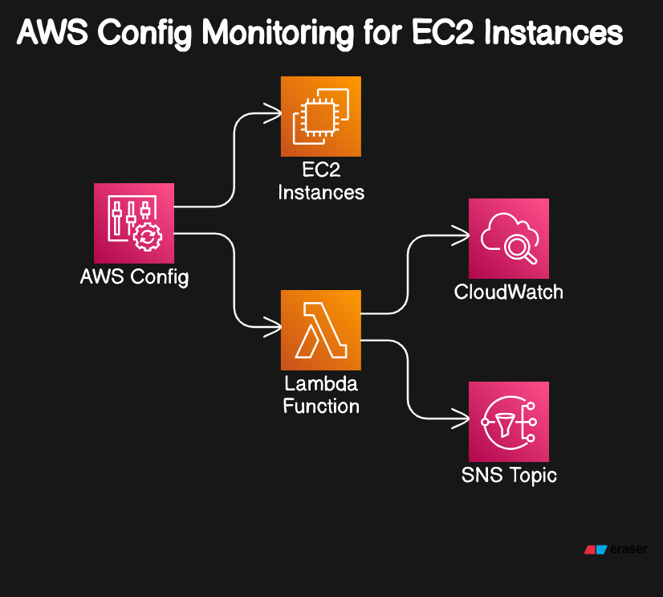

# Ensuring AWS Compliance with AWS Config 😊

AWS Config, a powerful tool that ensures your AWS resources comply with organizational rules and regulations. In this blog, we'll break down how AWS Config helps maintain compliance and track the status of your AWS resources effortlessly. Let's dive right in! 🌟

What is AWS Config?
AWS Config is a service that monitors and records your AWS resources' configurations, evaluating them against desired configurations or rules set by your organization. It ensures your resources align with compliance standards, making it easier to identify any non-compliant resources. 🛡️

# Project Description and Use Case
Project Description: Implement AWS Config to monitor EC2 instances and ensure they adhere to the organizational rule of having detailed monitoring enabled.

**Use Case:** Let's say your organization mandates that all EC2 instances must have detailed monitoring enabled for security and performance tracking. AWS Config will help you monitor this rule, automatically flagging any instance that doesn't comply.

# Demonstration Overview
In this example, we have two EC2 instances:

Compliant Instance: Detailed monitoring enabled.
Non-Compliant Instance: Detailed monitoring disabled.
Our goal is to use AWS Config to identify which instances comply with our organizational rules.

## Step-by-Step Guide

1. Setting Up AWS Config
Search for AWS Config: In the AWS Management Console, search for AWS Config and navigate to it.
Create a Rule: Click on "Add Rule" and choose either a managed rule or a custom Lambda rule. For this demo, we will create a custom Lambda rule.

2. Creating a Lambda Function
Create Function: Go to the Lambda service, create a new function, and choose Python as the runtime.

Write the Lambda Code: The Lambda function will check if the EC2 instance has detailed monitoring enabled and update AWS Config with the compliance status.

Permissions: Ensure the Lambda function has the necessary IAM roles and permissions to interact with AWS resources and AWS Config.

3. Linking Lambda Function with AWS Config Rule
Config Rule Setup: In the AWS Config console, provide the ARN of the Lambda function in the rule configuration.

Define Resources: Specify EC2 instances as the resources to be monitored.

4. Monitoring Compliance
Run the Setup: AWS Config will now monitor EC2 instances based on the defined rule.
Check Compliance Status: The compliance status of each instance is updated in the AWS Config dashboard.

## Troubleshooting

If the compliance status is not updating as expected:

Check CloudWatch Logs: Look for errors or timeout issues.
Increase Lambda Timeout: Adjust the timeout setting if the function is timing out.
Conclusion
AWS Config is an essential tool for maintaining compliance in your AWS environment. By following this guide, you can ensure your EC2 instances adhere to your organization's rules, providing a secure and well-monitored infrastructure.

Happy configuring! 🎉