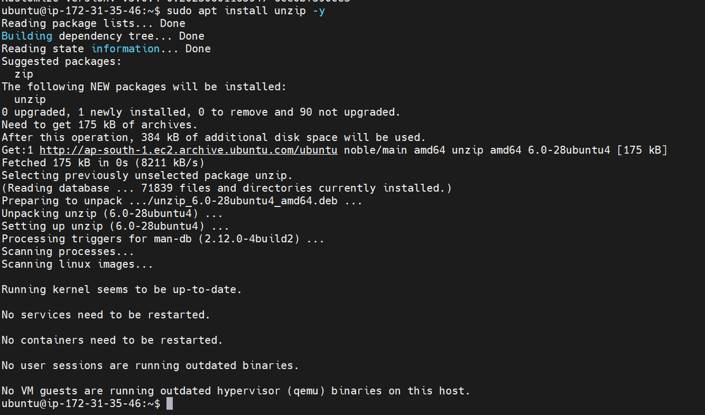
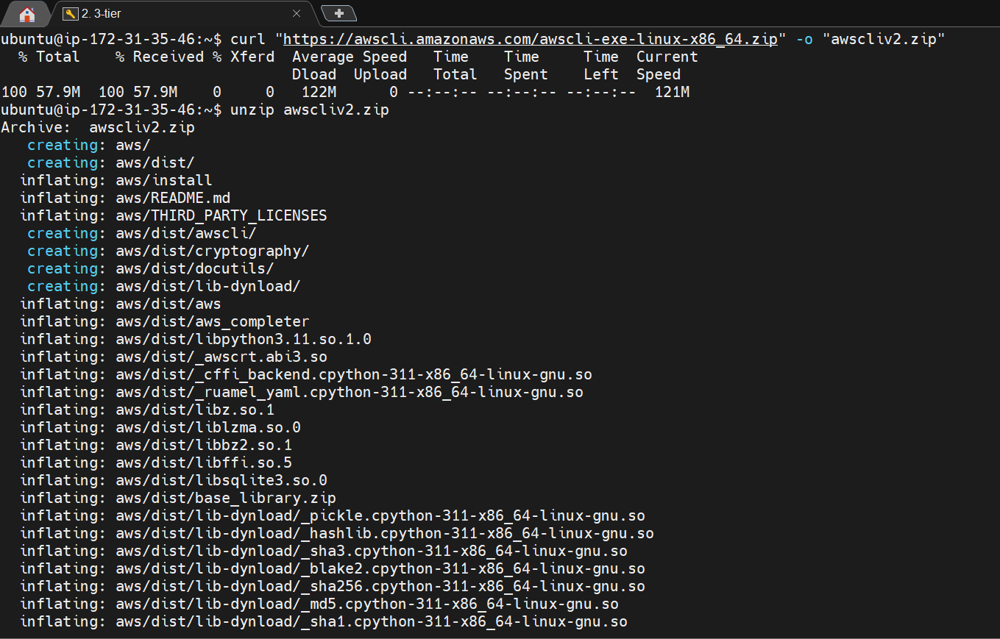
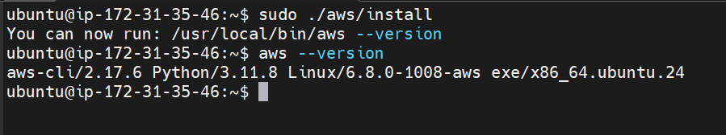
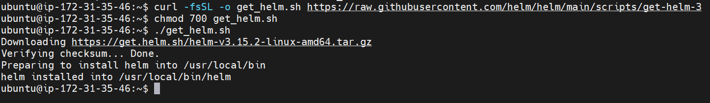
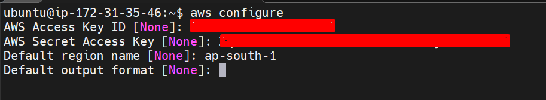

# 
# In-Depth Analysis of Robot Shop: Unveiling 3-Tier Architecture, Core Services, and Dual Database Integration


# 🌟 Embarking on a Voyage: Exploring Stan’s Robot Shop — An Educational Microservices Application 🌟

Dive into the World of Containerized Applications and Deployment Methodologies in a Practical Sandbox Environment. 🛠️

Acknowledgments to Abhishek Veeramalla for his contribution. 🙏

Watch the video here: [YouTube Video](https://youtu.be/8T0UnSgywzY?si=cZDDK09klAd-2vuI)

---

## Step 1: IAM User Creation in AWS 🚀

1. **Log in to the AWS console using your credentials.**

2. **In the search bar, enter ‘IAM’ to access the IAM Dashboard.**

3. **Navigate to the ‘Users’ section and select ‘Create User’.**

    _(just imagine a cool IAM dashboard here)_

4. **Enter a Name, Check the Desired Options, and Proceed to Next Step**

   _Tip: Explore Direct Attachment of Policies like AdministratorAccess for Educational Purposes_ 🎓

5. **Click Next, then Create user.**

6. **Select View User to Access User Details and Security Credentials.**

7. **Within security credentials, navigate to Access keys and proceed to Create a new access key.**

8. **Choose CLI, Agree to Terms, and Proceed to Next.**

9. **Download the .csv File and Click ‘Done’.**

---

## Step 2: Create EC2 Instance 🌐

**Provisioning an EC2 Instance on AWS: A Step-by-Step Guide**

1. **Sign in to AWS Console:**
   - Log in to your AWS Management Console.

2. **Navigate to EC2 Dashboard:**
   - Access the EC2 Dashboard by selecting “Services” in the top menu.
   - Choose “EC2” under the Compute section.

3. **Launch Instance:**
   - Click on the “Launch Instance” button to initiate the creation process.

4. **Choose an Amazon Machine Image (AMI):**
   - Select a suitable AMI (e.g., Ubuntu) for your instance.

5. **Choose an Instance Type:**
   - In the “Choose Instance Type” step, opt for t2.medium.
   - Proceed by clicking “Next: Configure Instance Details.”

6. **Configure Instance Details:**
   - Set “Number of Instances” to 1 (adjust if necessary).
   - Configure additional settings such as network, subnets, IAM role, etc.
   - For “Storage,” add a new volume and set the size to 8GB (or modify existing storage to 16GB).
   - Click “Next: Add Tags” when configuration is complete.

7. **Add Tags (Optional):**
   - Optionally, add tags to organize your instance.

8. **Configure Security Group:**
   - Choose an existing security group or create a new one.
   - Ensure the security group has necessary inbound/outbound rules for required access.

9. **Review and Launch:**
   - Review the configuration details to ensure they are as desired.

10. **Select Key Pair:**
    - Choose “Choose an existing key pair” from the dropdown.
    - Acknowledge access to the selected private key file.

11. **Launch Instances:**
    - Click “Launch Instances” to create the EC2 instance.

12. **Access the EC2 Instance:**
    - Once the instance is launched, access it using the selected key pair and the instance’s public IP or DNS.

   _Optimize Security for Your EC2 Instance: Implement Essential Permissions and Best Practices in Configuring Security Groups and Key Pairs._ 🛡️

---

## Step 3: Connect to Instance and Install Required Packages 📦

**Eksctl**

```bash
sudo apt update
curl --silent --location "https://github.com/weaveworks/eksctl/releases/latest/download/eksctl_$(uname -s)_amd64.tar.gz" | tar xz -C /tmp
sudo mv /tmp/eksctl /usr/local/bin
eksctl version
```


Kubectl

```bash
curl -O https://s3.us-west-2.amazonaws.com/amazon-eks/1.28.3/2023-11-14/bin/linux/amd64/kubectl
sudo chmod +x ./kubectl
mkdir -p $HOME/bin && cp ./kubectl $HOME/bin/kubectl && export PATH=$HOME/bin:$PATH
kubectl version --client
```


Helm

```bash
curl -fsSL -o get_helm.sh https://raw.githubusercontent.com/helm/helm/main/scripts/get-helm-3
chmod 700 get_helm.sh
./get_helm.sh
```







## Step 4: EKS Setup ⚙️
Configure AWS Settings for us-east-1 Region

```bash
aws configure
```


Clone the GitHub Repository: A Step-by-Step Guide

```bash
https://github.com/iam-veeramalla/three-tier-architecture-demo.git
```

## Establish Cluster

```python
eksctl create cluster --name demo-cluster-three-tier-1 --region us-east-1
```


# Setting Up Commands for Configuring IAM OIDC Provider 🎛️

Use Cluster Name demo-cluster-three-tier-1

```python
export cluster_name=demo-cluster-three-tier-1

oidc_id=$(aws eks describe-cluster --name $cluster_name --query "cluster.identity.oidc.issuer" --output text | cut -d '/' -f 5)

aws iam list-open-id-connect-providers | grep $oidc_id | cut -d "/" -f4

eksctl utils associate-iam-oidc-provider --cluster $cluster_name --approve
```


## Setting Up ALB Add-On 📡

Downloading IAM Policy

```python
curl -O https://raw.githubusercontent.com/kubernetes-sigs/aws-load-balancer-controller/v2.5.4/docs/install/iam_policy.json
aws iam create-policy \
    --policy-name AWSLoadBalancerControllerIAMPolicy \
    --policy-document file://iam_policy.json
```

Create IAM Role with Cluster Name and AWS Account ID

```python
eksctl create iamserviceaccount \
  --cluster=demo-cluster-three-tier-1 \
  --namespace=kube-system \
  --name=aws-load-balancer-controller \
  --role-name AmazonEKSLoadBalancerControllerRole \
  --attach-policy-arn=arn:aws:iam::<your-aws-account-id>:policy/AWSLoadBalancerControllerIAMPolicy \
  --approve
```

Implement ALB Controller

```python
helm repo add eks https://aws.github.io/eks-charts
helm repo update eks
helm install aws-load-balancer-controller eks/aws-load-balancer-controller -n kube-system --set clusterName=demo-cluster-three-tier-1 --set serviceAccount.create=false --set serviceAccount.name=aws-load-balancer-controller --set region=us-east-1 --set vpcId=<vpc-id>
kubectl get deployment -n kube-system aws-load-balancer-controller
```


EBS CSI Plugin Setup and Configuration 💾
Create an IAM Role and Attach a Policy for Cluster: demo-cluster-three-tier-1

```python
eksctl create iamserviceaccount \
    --name ebs-csi-controller-sa \
    --namespace kube-system \
    --cluster demo-cluster-three-tier-1 \
    --role-name AmazonEKS_EBS_CSI_DriverRole \
    --role-only \
    --attach-policy-arn arn:aws:iam::aws:policy/service-role/AmazonEBSCSIDriverPolicy \
    --approve

```


Execute the following command, replacing YOUR_CLUSTER_NAME and YOUR_ACCOUNT_ID

```python
eksctl create addon --name aws-ebs-csi-driver --cluster demo-cluster-three-tier-1 --service-account-role-arn arn:aws:iam::<AWS-ACCOUNT-ID>:role/AmazonEKS_EBS_CSI_DriverRole --force
```


Navigate into the Helm and Establish a New Namespace

```python
cd helm
kubectl create ns robot-shop
helm install robot-shop --namespace robot-shop .
kubectl get pods -n robot-shop
kubectl get svc -n robot-shop
kubectl apply -f ingress.yaml
```


Navigate to AWS Console, Locate EC2, and Access Load Balancers — Copy DNS

```python
k8s-robotsho-robotsho-55094ff83e-535495866.us-east-1.elb.amazonaws.com
```
Open a fresh tab and insert the DNS.


## Step 5: DELETE CLUSTER 🗑️


Input This Command Immediately

```python
eksctl delete cluster --name demo-cluster-three-tier-1 --region us-east-1
```


